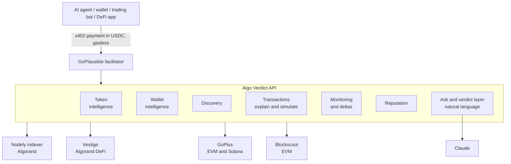

# Algo Verdict API — The Blockchain Intelligence Layer for AI Agents, Wallets and DeFi

[](https://www.npmjs.com/package/verdict-mcp)

**Algo Verdict API is an x402-native intelligence API.** AI agents, wallets, trading bots and DeFi
applications pay per request for blockchain intelligence, settled in USDC on Algorand via the
[x402 protocol](https://algorand.co/agentic-commerce/x402/developers).

No API key. No account. No subscription. No rate limit. Your agent pays only when it actually
needs an answer, and it can do that without a human in the loop.

Instead of every project rebuilding wallet analysis, token risk, monitoring and reputation from
scratch, they ask one endpoint and get structured intelligence back with the reasoning attached.

Analytics tells you a wallet made 42 trades. Algo Verdict API tells you that wallet was funded
through three throwaway addresses last week, moves in lockstep with eleven others, and has never
held a token longer than an hour.

## The API answers questions

**Should I trade this token?** → `POST /token/analyze`
Liquidity depth and lock status, holder concentration, deployer history, and a `rug_probability`
with the specific signals behind it — not a black-box score. Ethereum, Base, BSC, Solana and
Algorand.

**Can I trust this wallet?** → `POST /wallet/analyze`
Whether it behaves like a bot, an accumulator, or a wallet that just woke up after a year, with a
risk score and the confidence attached to it. Ethereum, Base and Algorand.

**Where did these funds come from?** → `POST /wallet/analyze?depth=deep`
Funding walked back hop by hop toward an exchange, a bridge, or a mixer.

**Which wallets belong together?** → `POST /wallet/analyze?depth=deep`
Wallets funded by the same source in the same minutes, with the timing correlation that links
them.

**Ask anything** → `POST /ask`
A question in plain language, routed across every capability above and answered only from what
they returned. The structured results come back attached to the prose, so each figure can be
checked against its source rather than taken on trust.

**What's this wallet's standing?** → `POST /reputation`
A cheap, cacheable score built for wallets and explorers to embed. Every weighted component is
published with the score, plus a penalty when an account is rekeyed to another key, and known
burn or mixer addresses are flagged outright rather than scored. Algorand.

**Is this app safe to interact with?** → `POST /contract/analyze`
Creator, privileged addresses decoded out of global state, state schemas, TEAL version, which
OnCompletion types the approval program actually tests for, and the TVL in the app account.
`audit_status` and `methods` are always null, and the response says why. Algorand.

**Who's actually moving this token?** → `POST /smart-money`
The wallets behind the largest swaps in a window, with buy and sell volume, average buy against
average sell price, holding period and current position. Ranked by size, not by claimed skill —
and the methodology ships in the response. Algorand.

**What am I actually holding?** → `POST /portfolio`
Balances from the chain, USD valuation and allocation per position, LP positions, and 30-day
buy/sell flows on the largest holdings. Assets nobody can price keep their balance and report a
null value instead of vanishing from the list. Algorand.

**What's trending right now?** → `POST /discover`
New launches that actually have liquidity behind them, most-swapped assets, tokens running hot
against their own 7-day average, TVL moves, pools created in the last hour, and 24h volume by
protocol. Post an empty body to get all of it. Algorand.

**What actually happened in this transaction?** → `POST /tx/explain`
One sentence plus the numbers behind it: net asset movement for the sender across the whole
atomic group and every inner transaction, fees, the realised rate against the pre-trade market
rate, and named safety checks. Algorand.

**Would this transaction fail, and why?** → `POST /tx/simulate`
Run an unsigned group against current chain state without submitting it. Note that this is
*pre-flight only*: a transaction that already failed was never written to the ledger, so it
cannot be explained after the fact — on this or any other Algorand service. Algorand.

**What changed since I last looked?** → `POST /watch/poll`
Cursor-based deltas across everything you're watching — wallet activity, liquidity moves, holder
shifts — priced so that polling on a schedule is actually viable.

More capabilities are in flight. See the [roadmap](#roadmap) — and note that everything listed
above is live right now, not planned.

## Architecture



Algo Verdict API does not custody funds, execute trades, or sign anything on your behalf. It
reads chains and answers questions.

## Quickstart — from an AI agent

Add this to your MCP client's config (Claude Desktop: `claude_desktop_config.json`;
Claude Code: `.mcp.json`), then restart it:

```json
{
  "mcpServers": {
    "verdict": {
      "command": "npx",
      "args": ["-y", "verdict-mcp"],
      "env": { "ALGORAND_PRIVATE_KEY": "your 25 word mnemonic" }
    }
  }
}
```

Your agent gains eleven paid tools — token, wallet, transaction explain and simulate, discovery,
portfolio, smart money, contract, reputation, ask and watch — plus free tools for checking its
wallet balance and learning how to fund one.

**No wallet yet?** Install it without the `env` block — the free tools work immediately, and
any paid tool will tell your agent exactly how to get funded. See
[`mcp/`](mcp/README.md) for full MCP documentation.

## Quickstart — from HTTP

Any x402-capable client works. Request without payment and you get `HTTP 402` plus the
payment terms in the `payment-required` header:

```bash
curl -X POST https://algorand-inteligence-api-production.up.railway.app/token/analyze \
  -H "Content-Type: application/json" \
  -d '{"asset": "31566704", "chain": "algorand"}'
```

Your client signs a USDC payment, retries, and gets the analysis. Payment is **gasless** —
the [GoPlausible facilitator](https://facilitator.goplausible.xyz) covers Algorand
transaction fees, so you only need USDC to spend.

## Endpoints and pricing

Every route below is live. Nothing on this table is aspirational.

| Route | Price | What you get |
|---|---|---|
| `POST /token/analyze` | $0.05 | Liquidity and lock status, holder concentration, deployer history, rug probability with named signals, verdict |
| `POST /wallet/analyze` | $0.08 | Funding ancestry, behavioral labels, risk score with confidence, verdict |
| `POST /wallet/analyze?depth=deep` | $0.50 | Adds multi-hop funding ancestry and co-funded wallet clusters |
| `POST /ask` | $0.12 | Natural-language questions routed across every capability, answered only from their output |
| `POST /reputation` | $0.02 | Standing score with every component named, rekey penalty, known-entity flags (Algorand) |
| `POST /contract/analyze` | $0.05 | Creator, privileged addresses, state schema, TEAL analysis, app-account TVL (Algorand) |
| `POST /smart-money` | $0.10 | Wallets moving an asset, with volumes, avg buy vs sell price, holding period, stated methodology (Algorand) |
| `POST /portfolio` | $0.04 | Holdings, valuation, allocation, LP positions, 30-day trade flows (Algorand) |
| `POST /discover` | $0.03 | New launches, trending, volume growth, liquidity moves, fresh LPs, protocol volume (Algorand) |
| `POST /tx/explain` | $0.02 | What a transaction did, in prose: net flows, protocol, fees, realised vs pre-trade rate, safety flags (Algorand) |
| `POST /tx/simulate` | $0.02 | Whether a transaction group would succeed, and the exact failure and index if not — before you sign (Algorand) |
| `POST /watch/poll` | $0.01 | Everything that changed across your watched wallets and tokens since your cursor |
| `GET /` | free | Service card: endpoints, prices, payment terms |
| `GET /fund` | free | How to get a wallet that can pay, as JSON |
| `GET /health` | free | Liveness |

An empty `/watch/poll` result still costs $0.01 — the query ran, and that's the honest
model for polling.

### Request shapes

```jsonc
// POST /token/analyze
{ "asset": "31566704", "chain": "algorand" }   // contract address, or ASA id on Algorand

// POST /wallet/analyze   (add ?depth=deep for the $0.50 tier)
{ "address": "0x28C6...", "chain": "base" }

// POST /ask
{ "question": "Is ASA 31566704 safe to trade, and who has been buying it this week?" }

// POST /reputation
{ "address": "PV3QMHIOZ6X7246YBAI66XUALSTT6UCSLJQE4YVQS6TQWG33N4BIBAZANM" }

// POST /contract/analyze
{ "app_id": "1002541853" }

// POST /smart-money
{ "asset": "3109829078", "window_days": 7, "limit": 10 }

// POST /portfolio
{ "address": "PV3QMHIOZ6X7246YBAI66XUALSTT6UCSLJQE4YVQS6TQWG33N4BIBAZANM" }

// POST /discover — empty body means every signal
{ "signals": ["trending", "new_launches"], "limit": 10 }

// POST /tx/explain
{ "txid": "FPGSILQHO2KB5VLPV7YF73ZXL4PSCAZFYSSIET7H5LUVOSG2DTTQ" }

// POST /tx/simulate — atomic group in order, base64, unsigned is the normal case
{ "txns": ["gqNzaWfEQ...", "gqNzaWfEQ..."] }

// POST /watch/poll  — omit cursor on the first call to establish baselines
{ "cursor": "eyJ2IjoxLCJ0Ijo...", "watch": [
    { "type": "wallet", "address": "0xabc...", "chain": "base" },
    { "type": "token", "asset": "31566704", "chain": "algorand" }
] }
```

## Nothing is invented

Every field a data source can't provide comes back `null`. Not zero, not a plausible guess, not
an omitted key — `null`, so your agent can tell the difference between "we looked and it's clean"
and "we couldn't see."

The same rule governs what gets built. A few things you will *not* find here, because the data
to support them does not exist:

- **Historical failed-transaction analysis.** Algorand's ledger only stores committed
  transactions. A transaction that failed was never written to a block, so no indexer can explain
  it after the fact. `POST /tx/simulate` answers the same question the only way it can be
  answered — ahead of submission. Retroactive post-mortems are not possible on any Algorand
  service, including this one.
- **Contract audit status.** There is no Algorand audit registry to query. When contract
  intelligence ships, that field will be `null` rather than a guess.
- **Verified contract source.** Algorand apps live on-chain as bytecode. Disassembly is possible;
  showing original source is not.

Scores are deterministic and the contributing signals are always named, so you can see *why*
something scored the way it did rather than trusting a number.

## Roadmap

Algo Verdict API is built as an intelligence layer, not a fixed set of endpoints. The
capabilities below are in flight, ordered by data confidence.

**Live** — token intelligence, wallet intelligence, funding ancestry, co-funding clusters,
transaction explain, pre-flight simulation, the discovery feed, portfolio valuation, smart-money
tracking, contract intelligence, address reputation, natural-language ask, cursor-based
monitoring, LLM-written verdicts, MCP server, agent funding rail.

**Planned**

- **Webhooks with prepaid credits.** Push delivery instead of polling. x402 has no native model
  for this, because payment attaches to a request and a webhook has none — so the design is
  prepaid: pay once, drain a balance as events are delivered, stop when it runs dry. Documented
  here because the payment design is the interesting part, not the delivery code.
- **Python SDK.** No Python x402 client exists for the AVM exact scheme today, which means Python
  agents currently cannot pay on Algorand at all. Fixing that is worth more than another endpoint.

New capabilities launch Algorand-first. `/token/analyze` and `/wallet/analyze` remain cross-chain.

## From TypeScript

```bash
npm install verdict-sdk
```

```ts
import { VerdictClient } from "verdict-sdk";

const verdict = new VerdictClient({ privateKey: process.env.ALGORAND_PRIVATE_KEY });
const token = await verdict.analyzeToken({ asset: "31566704", chain: "algorand" });
const answer = await verdict.ask({ question: "Who has been buying it this week?" });
```

Full method list in [`sdk/ts/`](sdk/ts). Without a key the free methods still work and paid ones
throw `PaymentNotConfiguredError` with funding instructions instead of failing obscurely.

## Examples

Three programs that use this for real, in [`examples/`](examples):

| Example | What it shows |
|---|---|
| [`ai-agent/`](examples/ai-agent) | An agent applying its own risk rules before trading, refusing anything it could not measure |
| [`portfolio-tracker/`](examples/portfolio-tracker) | Valuation, allocation and per-asset deltas across repeated polls |
| [`telegram-bot/`](examples/telegram-bot) | A chat bot answering token, wallet, transaction and free-form questions |

Each runs unfunded and tells you how to get a wallet, so you can try them before spending
anything.

## Performance

Time to gather and compute the intelligence, measured with `npm run benchmark -- --analysis`:

| Capability | Cold | Cached |
|---|---|---|
| `contract/analyze` | 566ms | 0ms |
| `reputation` | 663ms | 0ms |
| `smart-money` | 1253ms | 0ms |
| `discover` (all signals) | 1850ms | 0ms |
| `portfolio` | 1995ms | 0ms |
| `tx/explain` | 2237ms | 0ms |
| `token/analyze` * | 9503ms | 0ms |

Cold is the median of three cache-cleared runs; cached is the same call served from SQLite.
Upstream data sources dominate the cold figure and it moves with their load.

\* The token path includes an LLM call to write the verdict. That prose is cached against a hash
of the signals, so it only regenerates when the underlying picture changes — clearing the cache
forces it on every cold run above.

Caching is shared across callers, which is why `/tx/explain` costs $0.02: a committed transaction
never changes, so its explanation is computed once and served forever.

## Getting a wallet that can pay

Most agents live on Base or Solana and **can't pay on Algorand** — it needs an Algorand
account, a USDC opt-in, and a small ALGO reserve. Circle's CCTP doesn't bridge to Algorand
either, so there's no obvious on-ramp.

This repo ships a free one that works with **any** x402 service on Algorand, not just this
one:

```bash
git clone https://github.com/AlgoIntel01/Algorand-Inteligence-API
cd Algorand-Inteligence-API && npm install
npm run fund-agent                # add --json for machine-readable output
```

It generates a keypair locally, waits while you send native ALGO from any exchange or
wallet, opts into USDC, swaps the spare ALGO into USDC through the Vestige aggregator, and
prints a wallet ready to pay.

**Your keys never leave your machine.** Every swap transaction is decoded and checked
locally before signing — the CLI refuses to sign anything containing a rekey, a close-out,
an unreasonable fee, or an unexpected asset. Use `--dry-run` to see the quote and safety
check without submitting anything.

## Where the data comes from

Token analysis draws on GoPlus for EVM chains and Solana, and the Nodely indexer plus
Vestige for Algorand. Wallet analysis uses Blockscout for EVM chains and Nodely for
Algorand. The verdict prose is written by Claude from those signals and cached against a hash of
them, so the model runs only when the underlying picture actually changes.

## Support and license

Issues and pull requests welcome at
[the repo](https://github.com/AlgoIntel01/Algorand-Inteligence-API/issues). MIT licensed —
the funding rail in particular is meant to be reused by anyone building on Algorand x402.
